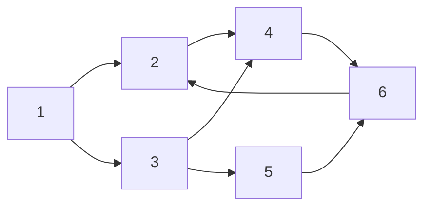

# Տնային Աշխատանք — Depth-First Search

## Խնդրի հիշեցում

Տրված է `G = (V, E)` գրաֆ (ուղղորդված կամ չուղղորդված), ներկայացված հարևանության ցուցակով: Կատարել DFS շրջանցում:

```cpp
enum Color { WHITE, GRAY, BLACK };

struct Node {
    Color color  = WHITE;
    int   start  = 0;
    int   finish = 0;
};

unordered_map<string, vector<string>> adj;
unordered_map<string, Node> nodes;
int time_val = 0;

void dfs_visit(const string& u);
void dfs();
```

---

## Խնդիր 1

### Մաս 1ա — Լրացնել աղյուսակը

Տրված ուղղորդված գրաֆ.

```txt
Հարևանության ցուցակ.
  1 → [2, 3]
  2 → [4]
  3 → [4, 5]
  4 → [6]
  5 → [6]
  6 → [2]
```



DFS սկսած 1-ից (հարև. ըստ աճման կարգի): Լրացնել.

| Գագաթ | start | finish | color (վերջ) |
| --- | --- | --- | --- |
| 1 | | | |
| 2 | | | |
| 3 | | | |
| 4 | | | |
| 5 | | | |
| 6 | | | |

Ո՞ր կողն է back edge — ո՞ր ցիկլն է ցույց տալիս:

### Մաս 1բ — Կողերի Դասակարգում

Լրացնել ամեն կողի տեսակը.

| Կող | Տեսակ |
| --- | --- |
| 1→2 | |
| 1→3 | |
| 2→4 | |
| 3→4 | |
| 3→5 | |
| 4→6 | |
| 5→6 | |
| 6→2 | |

---

## Խնդիր 2 — Իրականացում

### Մաս 2ա — DFS

Իրականացնել `dfs_visit` և `dfs`:

```cpp
void dfs_visit(const string& u) {
    // TODO
}

void dfs() {
    // TODO: nodes-ը սկզբնարժեքավորել WHITE-ով
    // TODO: loop բոլոր գագաթների վրա, WHITE-ների համար dfs_visit
}
```

Ստուգել հետևյալ test case-երով.

| Գրաֆ (կողեր) | Ուղ. | n | Ակնկ. |
| --- | --- | --- | --- |
| 1→2, 2→3, 3→1 | ուղ. | 3 | start: 1,2,3 / finish: 6,5,4 |
| 1-2-3-4-5-1 | չուղ. | 5 | start: 1,2,3,4,5 / finish: 10,9,8,7,6 |

### Մաս 2բ — Iterative DFS

Իրականացնել `dfsIterative` ֆունկցիան (stack-ով).

```cpp
void dfsIterative() {
    // TODO
}
```

Ստուգել.

- Խնդիր 1-ի գրաֆ → ռեկուրսիվ ու iterative-ի start կարգը նույնն ե՞ն:

---

## Խնդիր 3 — Ճանապարհ Երկու Գագաթների Միջև

Իրականացնել ֆունկցիան, որը մուտքում ստանում է երկու գագաթ `s` և `t`, և վերադարձնում է դրանք միացնող ցանկացած ճանապարհ: Եթե ճանապարհ գոյություն չունի — վերադարձնել դատարկ զանգված:

```cpp
vector<string> findPath(const string& s, const string& t);
// Մուտք:  s — մեկնարկային գագաթ, t — նպատակային գագաթ
// Ելք:    s-ից t ճանապարհ [s, ..., t], կամ [] եթե չկա
```

Ստուգել.

| Գրաֆ (կողեր) | Ուղ. | s | t | Ակնկ. |
| --- | --- | --- | --- | --- |
| A-B, B-C, C-D | չուղ. | A | D | [A, B, C, D] |
| A→B, B→C | ուղ. | A | C | [A, B, C] |
| A→B, C→D | ուղ. | A | D | [] (կապ չկա) |
| A-B, B-C, A-C (ցիկլ) | չուղ. | A | C | [A, B, C] կամ [A, C] |
| A-B-C-D-E-A | չուղ. | B | E | [B, C, D, E] կամ [B, A, E] |
